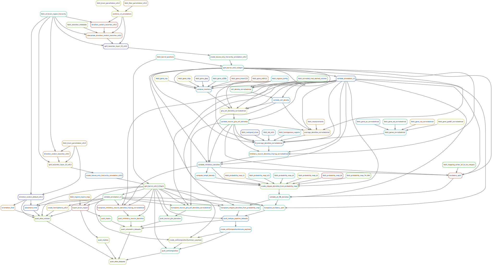

# Blue Brain Atlas Pipeline

## Introduction

The Blue Brain Atlas Pipeline (BBAP) is a set of processing modules that generate new data such as:

- Annotation volume, brain region hierarchy, direction vectors, orientations and placement hints for selected brain regions,
- Cell density volumes for several cell types,
- CellComposition summary of the brain regions.


## Installation

The Blue Brain Atlas Pipeline (BBAP) can be installed in three different ways:
- via a [Singularity image](#singularity-image-on-bb5) (recommended),
- via a [Docker image](#docker-image),
- via this [Git repository](#git-repository).

For computation time reason and ease of installation, it is recommended to run the pipeline 
on the BB5 cluster via the Singularity image described [hereafter](#singularity-image-on-bb5).
You can log in to the cluster with  
`ssh -l <your-Gaspar-username> bbpv1.epfl.ch`  
and your Gaspar password, or via the [OpenOnDemand service](https://bbpteam.epfl.ch/project/spaces/display/SDKB/JupyterHub+on+BB5).

Once the installation step is completed, go to [Run the pipeline](#run-the-pipeline) for the instructions to run the pipeline.

### Singularity image on BB5
A Singularity image (created from the [Docker image](#docker-image)) is available on BB5 in:  
`/gpfs/bbp.cscs.ch/data/project/proj84/atlas_singularity_images/`

The folder contains
- `blue_brain_atlas_pipeline_dev.sif`: development image regularly updated,
- `blue_brain_atlas_pipeline_<tag>.sif`: production image corresponding to a repository [tag](https://bbpgitlab.epfl.ch/dke/apps/blue_brain_atlas_pipeline/-/tags)
  (such as `v0.5.2`).

One can spawn the corresponding container with (example with dev) 
1. `module load unstable singularityce`
2. `singularity shell /gpfs/bbp.cscs.ch/data/project/proj84/atlas_singularity_images/blue_brain_atlas_pipeline_dev.sif`

and run the following commands to copy the pipeline files in a path (e.g `$HOME`) where snakemake can write:  
3. `cp -r /pipeline/blue_brain_atlas_pipeline $HOME`  
4. `cd blue_brain_atlas_pipeline`  

Now you can go to [Run the pipeline](#run-the-pipeline) for the instructions to run the pipeline.


### Docker image
A [Docker](https://docs.docker.com/reference) image containing all the pipeline dependencies is available in the Git [registry](https://bbpgitlab.epfl.ch/dke/apps/blue_brain_atlas_pipeline/container_registry/159):  
`bbpgitlab.epfl.ch:5050/dke/apps/blue_brain_atlas_pipeline:<tag>`  
where `<tag>` = `dev` or a repository tag. 

It can be pulled and run with  
1. `docker login bbpgitlab.epfl.ch:5050 -u <your-Gaspar-username> -p <your-Gaspar-password>`
2. `docker pull bbpgitlab.epfl.ch:5050/dke/apps/blue_brain_atlas_pipeline:<tag>`
3. `docker run -it bbpgitlab.epfl.ch:5050/dke/apps/blue_brain_atlas_pipeline:<tag> bash`
4. `cd blue_brain_atlas_pipeline`

or converted into an **Apptainer** image with  
`apptainer pull --docker-login docker://bbpgitlab.epfl.ch:5050/dke/apps/blue_brain_atlas_pipeline:<tag>`

Now you can go to [Run the pipeline](#run-the-pipeline) for the instructions to run the pipeline.


### Git repository
The BBAP can be installed directly from the `setup.py` file available in this repository:

1. `git clone https://bbpgitlab.epfl.ch/dke/apps/blue_brain_atlas_pipeline.git`
2. `pip install blue_brain_atlas_pipeline/`
3. `cd blue_brain_atlas_pipeline`

#### Dependencies
Each package run as part of the pipeline is considered a pipeline dependency:

- [token-fetch](https://bbpgitlab.epfl.ch/dke/apps/blue_brain_nexus_token_fetch)
- [nexusforge](https://github.com/BlueBrain/nexus-forge)
- [bba-datafetch](https://bbpteam.epfl.ch/project/spaces/display/BBKG/bba-data-fetch)
- [atlas-direction-vectors](https://github.com/BlueBrain/atlas-direction-vectors)
- [atlas-splitter](https://github.com/BlueBrain/atlas-splitter)
- [atlas-placement-hints](https://github.com/BlueBrain/atlas-placement-hints)
- [atlas-densities](https://github.com/BlueBrain/atlas-densities)
- [parcellationexport](https://bbpteam.epfl.ch/project/spaces/display/BBKG/parcellationexport)
- [bba-data-integrity-check](https://bbpteam.epfl.ch/project/spaces/display/BBKG/bba-data-check)
- [bba-data-push](https://bbpteam.epfl.ch/project/spaces/display/BBKG/bba-data-push)

On BB5, most packages are available also as modules:
```
module load unstable \
snakemake \
py-token-fetch \
py-nexusforge \
py-bba-datafetch \
py-atlas-building-tools \
py-bba-webexporter \
py-data-integrity-check \
py-bba-data-push
```
Or they can be installed following the ‘Installation’ section in their Confluence documentation page.

Now you can go to [Run the pipeline](#run-the-pipeline) for the instructions to run the pipeline.


## Run the pipeline

Once the pipeline environment is [installed](#installation), from the root directory execute  
`export PYTHONPATH=.:$PYTHONPATH`  
and the general command to run the pipeline is available:
```
bbp-atlas  --target-rule <target_rule>  --snakemake-options '<options>'
```
where
- `<target_rule>` represents the target action to execute.
- `<options>` represents the snakemake options.  
A set of most common options is available [here](#useful-snakemake-options). 
The option  `--cores <number_of_cores>` is mandatory for now, unless the `--dryrun` option is used,
and must be provided as last option.

The main entities generated by the pipeline are stored under the paths and names defined 
in the config file located at `$HOME/blue_brain_atlas_pipeline/rules_config_dir_templates/push_dataset_config_template.yaml`.  
The following command:
```
  bbp-atlas  --target-rule push_atlas_release  --snakemake-options '--config NEXUS_REGISTRATION=False  --cores 1'
```
will generate (locally, without registering in Nexus) the following AtlasRelease (see the prod [AtlasRelease entity](https://bbp.epfl.ch/nexus/v1/resources/bbp/atlas/_/https:%2F%2Fbbp.epfl.ch%2Fneurosciencegraph%2Fdata%2F4906ab85-694f-469d-962f-c0174e901885)) datasets:
- parcellationVolume: annotation volume nrrd file generated at the location defined in the config under `GeneratedDatasetPath.VolumetricFile.annotation_ccfv3_l23split_barrelsplit`
- parcellationOntology: brain region hierarchy generated at the location defined in the config under `HierarchyJson.hierarchy_ccfv3_l23split_barrelsplit`
- directionVector: direction vector volume generated at the location defined in the config under `GeneratedDatasetPath.VolumetricFile.direction_vectors_ccfv3`
- cellOrientationField: orientation field volume generated at the location defined in the config under `GeneratedDatasetPath.VolumetricFile.cell_orientations`
- hemisphereVolume: orientation field volume generated at the location defined in the config under `GeneratedDatasetPath.VolumetricFile.hemispheres`
- placementHintsDataCatalog: json catalog of placement hints volumes generated at the location `WORKING_DIR/ph_catalog_distribution.json`
  This catalog has the format described in the [Appendix](#placement-hints-data-catalog-json-format) and groups the placement hints by regions and layers.
  The set of actual placement hints nrrd files are generated at the location defined in the config under `GeneratedDatasetPath.VolumetricFile.placement_hints`

The following command:
```
  bbp-atlas  --target-rule push_cellcomposition  --snakemake-options '--config NEXUS_REGISTRATION=False  --cores 1'
```
will generate (locally, without registering in Nexus) the following CellComposition (see the prod [CellComposition entity](https://bbp.epfl.ch/nexus/v1/resources/bbp/atlasdatasetrelease/_/https:%2F%2Fbbp.epfl.ch%2Fneurosciencegraph%2Fdata%2Fcellcompositions%2F54818e46-cf8c-4bd6-9b68-34dffbc8a68c)) datasets:
- cellCompositionVolume: json file generated at the location `WORKING_DIR/cellCompositionVolume_payload.json`, containing the ids of the METype density nrrd files registered in Nexus,
  grouped by M-type and E-type.  
  The set of METype densities is generated at the location defined in the config under `GeneratedDatasetPath.VolumetricFile.mtypes_densities_probability_map_transplant`
- cellCompositionSummary: json file generated at the location `WORKING_DIR/cellCompositionSummary_payload.json`, containing the values of the METype densities in the cellCompositionVolume,
  grouped by regions

The following command:
```
  bbp-atlas  --target-rule push_atlas_datasets  --snakemake-options '--config NEXUS_REGISTRATION=False  --cores 1'
```
will generate (locally, without registering in Nexus) all the previous listed datasets.

The rules in the previous commands trigger many intermediate dependent rules as described [here](#blue-brain-atlas-pipeline-1).

The pipeline consumes a configuration file described [here](#configuration), by default 
named `config.yaml` and located in the directory from which the pipeline is run.  
A specific config file can be provided via the `--configfile` option:
```
bbp-atlas  --target-rule <target_rule>  --snakemake-options '--configfile <config_file_path>'
```
***
**NOTE**  
To run the pipeline skipping the generation of datasets already available (in 
case a previous run failed at an intermediate step for instance), the [option](#useful-snakemake-options) 
`--rerun-trigger mtime` can be used as in the following command:
```
bbp-atlas  --target-rule <target_rule>  --snakemake-options '--rerun-trigger mtime  --cores 1'
```
Such an option allows to skip the execution of the pipeline steps whose output 
files exist and have a modification time (`mtime`) more recent than any of their
input files.
***

### Customize a pipeline rule

It is possible to customize a pipeline rule that generates a (set of) volumetric file 
(`.nrrd`) in order to change the values of a specific region of the volume (and leave 
the rest of the volume unchanged).
The customization happens via the configuration file [`customize_pipeline/user_config.json`](https://bbpgitlab.epfl.ch/dke/apps/blue_brain_atlas_pipeline/-/blob/develop/customize_pipeline/user_config.json)
with the following structure:
- `target_rule`: name of the final rule to execute (replaces the `--target-rule` CLI argument);
- `rule`: name of the rule to customize from the default pipeline;
- `brainRegion`: ID of the brain region to customize;
- `CLI`:
  - `command`: CLI to execute in order to produce the volumetric file with the desired values for the brain region of interest;
  - `args`: CLI arguments that can reference variables between curly brackets (see below);
- `output_dir`: path of the folder where the volumetric file(s) is generated by the CLI;
- `container`: URL of the Docker image to use in order to spawn a container where the CLI will be executed. This parameter
is optional: if not provided, the CLI will be executed in the same environment of the default pipeline (in such a case,
the user must ensure that the provided CLI is defined therein).

The CLI `args` can reference one or more variables which points to files generated by 
pipeline rules executed before the rule to customize. The list of variables is available
in [customize_pipeline/available_vars.yaml](https://bbpgitlab.epfl.ch/dke/apps/blue_brain_atlas_pipeline/-/blob/develop/customize_pipeline/available_vars.yaml). The user must ensure that the files generated by the provided CLI 
have the same names of the files generated by the rule to customize. For example, the 
rule `direction_vectors_placeholder_ccfv3` in the sample configuration generates one 
output file `direction_vectors_ccfv3.nrrd`. The `placement_hints` rule generates seven 
volumetric files: `[PH]y.nrrd` and `[PH]layer_n.nrrd` where n = 1, ..., 6.

Once the configuration file is ready, the customized pipeline can be run with the 
following command:
```
bbp-atlas  --user-config-file customize_pipeline/user_config.json  --snakemake-options '<options>'
```
_Note_: the Snakemake option `--use-singularity` must be provided for the configuration parameter `container` to be considered.

When a rule is customized as described above, the pipeline will run
1. the default rule to generate the default output file(s),
2. the CLI provided in the configuration file to produce the corresponding 
region-specific output file(s),
3. a merge step to override the specific region in the default file(s) (step 1) with the 
values of that region from the region-specific file(s) (step 2).

#### Integration
In case a user wants to request the integration of the customized version of a dataset:
1. Open a Merge Request (MR) in this repository including the updated `user-config-file`
and any additional input [metadata](#metadata) required.
2. The MR is then reviewed and, if approved, a new Atlas pipeline dev image is produced accordingly.
3. The new pipeline is run and the new datasets are registered in Nexus staging for wider tests.
4. When the new version of the datasets is validated, a new tag of the Atlas pipeline is
cut and the corresponding image is used to register the datasets in Nexus prod.

##### Metadata
Some pipeline steps require metadata as input, which are fetched from Nexus.  
Currently, the files available in the [`metadata`](https://bbpgitlab.epfl.ch/dke/apps/blue_brain_atlas_pipeline/-/tree/develop/metadata)
directory are automatically synchronized with their Nexus versions.  
If you want to update/add one metadata file, make sure to update/add also the 
corresponding documentation file in the [`metadata/docs`](https://bbpgitlab.epfl.ch/dke/apps/blue_brain_atlas_pipeline/-/tree/develop/metadata/docs)
directory, keeping the current naming convention (`probability_map_*{.csv,.txt}`).


### Useful Snakemake options

Snakemake being a command-line tool, it comes with a multitude of optional arguments to
execute, debug, and visualize workflows. Here is a selection of the most used:

- `--cores <number_of_cores>`, `-c <number_of_cores>` → Specify the number of cores 
snakemake can use.
- `--dry-run`, `-n` → Perform a dry run (execute nothing but print the list of rules
that would be executed).
- `--rerun-trigger mtime` → Use only the modification time (`mtime`) of the existing 
output files to determine which rules to execute.
- `--forcerun <some_rule>` → Force a given rule to be re-executed (overwrite the output 
if it already exists).
- `--list`, `-l` → Print a list of all the available rules from the snakefile.

Every Snakemake command line argument is listed and described in the [Snakemake](https://snakemake.readthedocs.io/en/stable/) official documentation page.


## Blue Brain Atlas Pipeline

Its workflow consists of the following steps:
1. Fetch the required datasets from Nexus. These input data consist of the [original AIBS ccfv3 brain parcellation](https://bbp.epfl.ch/nexus/web/bbp/atlas/resources/https%3A%2F%2Fbbp.epfl.ch%2Fneurosciencegraph%2Fdata%2F025eef5f-2a9a-4119-b53f-338452c72f2a), 
the [AIBS Mouse CCF Atlas regions hierarchy file](https://bbp.epfl.ch/nexus/web/neurosciencegraph/datamodels/resources/http%3A%2F%2Fbbp.epfl.ch%2Fneurosciencegraph%2Fontologies%2Fmba) and a series of Nissl and ISH volumes 
as described in the documentation page [Allen Mouse CCF Compatible Data](https://bbpteam.epfl.ch/project/spaces/display/BBKG/Allen+Mouse+CCF+Compatible+Data).
2. The fetched datasets are then fed to the [Snakemake](https://snakemake.readthedocs.io/en/stable/) rules, and under the hood consumed by atlas modules to generate products. 
3. Each product can (optionally) be pushed into Nexus with a set of metadata automatically filled up and be visualised in 
the [Blue Brain Atlas](https://bbpteam.epfl.ch/documentation/#:~:text=Visualize-,Blue%20Brain%20Atlas,-Morphology%20visualization).

This workflow is illustrated on the following diagram containing the directed acyclic graph (DAG)
of the Snakemake rules of the BBAP:



A more detailed DAG listing the input and output files for each step is available [here](https://bbpgitlab.epfl.ch/dke/apps/blue_brain_atlas_pipeline/-/blob/develop/doc/source/figures/dag_push_atlas_fg.svg).

#### Rules and modules  
In this document, a “module” is a CLI encapsulated inside one of the components of the pipeline.
Such component is called a “rule”. This terminology comes from SnakeMake, where a “rule” 
can leverage one or more modules and where a module can be used by one of more rules,
usually using a different set of arguments.  
You can find more information on rules in the [SnakeMake documentation](https://snakemake.readthedocs.io/en/stable/).

To only visualize the command that a given rule will execute without running it, one can
use the `--dryrun` option as in the following command:
```
  bbp-atlas  --target-rule <target_rule>  --snakemake-options '--dryrun'
```
The documentation of each command is available in the corresponding pipeline [dependency](#dependencies).

#### Fetch rules
The rules starting with "fetch_" are used to download a given file from Nexus.  
The IDs of the corresponding Nexus Resource (containing a description of the file to 
fetch) are listed in the [nexus_ids.json](https://bbpgitlab.epfl.ch/dke/apps/blue_brain_atlas_pipeline/-/blob/develop/nexus_ids.json) (the explicit link between a fetch 
rule and the corresponding Resource ID lays in the `nexus_id` parameter of the rule 
definition in the [snakefile](https://bbpgitlab.epfl.ch/dke/apps/blue_brain_atlas_pipeline/-/blob/develop/snakefile)).  
_Note_: the rule "fetch_genes_correctednissl" is not linked to a specific Resource, it's 
used just to trigger the execution of a set of single "fetch_gene_" rules needed by the
"fit-average-densities" step.

In order to run the pipeline with a different version of a fetched file, one can just
execute the corresponding fetch rule and subsequently replace the downloaded file with 
the desired version, by keeping the same name of the originally fetched file.  
The `--rerun-trigger mtime` [option](#useful-snakemake-options) may be useful here.


#### Additional information  
More information about The Blue Brain Atlas Pipeline (BBAP) are available in its [confluence documentation](https://bbpteam.epfl.ch/project/spaces/display/BBKG/Atlas+Pipeline).  
This space contains several documentation pages describing:  
The Allen Mouse CCF Compatible Data : [https://bbpteam.epfl.ch/project/spaces/display/BBKG/Allen+Mouse+CCF+Compatible+Data](https://bbpteam.epfl.ch/project/spaces/display/BBKG/Allen+Mouse+CCF+Compatible+Data)   
The Atlas Modules : [https://bbpteam.epfl.ch/project/spaces/display/BBKG/Atlas+Modules](https://bbpteam.epfl.ch/project/spaces/display/BBKG/Atlas+Modules)


## Configuration

The configuration of the pipeline is provided in the `config.yaml` file. The most important
variables that a user can customize are:

- `WORKING_DIR`: the output directory of the pipeline files,
- `NEXUS_IDS_FILE`: the json file containing the Ids of the Nexus Resources to fetch,
- `FORGE_CONFIG`: the configuration file (yaml) to instantiate nexus-forge,
- `NEW_ATLAS`: boolean flag to trigger the creation of a brand-new atlas release,
- `RESOLUTION`: resolution (in μm) of the input volumetric files to be consumed by the pipeline (default to 25),
- `NEXUS_REGISTRATION`: boolean flag to trigger data registration in Nexus
- `RESOURCE_TAG`: string to use as tag of the data registered in Nexus
- `IS_PROD_ENV`: boolean flag to indicate whether the target Nexus environment is production or not (staging),
- `NEXUS_DESTINATION_ORG`/`NEXUS_DESTINATION_PROJ`: Nexus organization/project where register the pipeline products,
- `DISPLAY_HELP`: boolean flag to display every rule of the snakefile with its descriptions.

It is possible to override the config variables at runtime using the snakemake argument `--config`:  
`--config <VAR_NAME>=<VALUE>`


## Authors and Contributors

* Leonardo Cristella: <leonardo.cristella@epfl.ch>
* Nabil Alibou: <nabil.alibou@epfl.ch>
* Jonathan Lurie: <jonathan.lurie@epfl.ch>

The BBAP is currently maintained by the BlueBrain DKE team: <bbp-ou-dke@groupes.epfl.ch>.
If you face any issue using the BBAP, please send an e-mail to one of the contributors.


## Appendix
### Placement hints data catalog json format
```json

{
  "placementHints": [
    {
      "@id": "https://bbp.epfl.ch/data/bbp/atlas/f1049c1b-f1af-4d33-acd9-099f05c56bbf",
      "_rev": 13,
      "distribution": {
        "atLocation": {
          "location": "file:///gpfs/bbp.cscs.ch/data/project/proj39/nexus/bbp/atlas/9/b/1/3/3/7/7/9/%5BPH%5Dlayer_1.nrrd"
        },
        "name": "[PH]layer_1.nrrd"
      },
      "regions": {
        "Isocortex": {
          "@id": "http://api.brain-map.org/api/v2/data/Structure/315",
          "hasLeafRegionPart": [
            "PL1",
            ...
          ],
          "layer": {
            "@id": "http://purl.obolibrary.org/obo/UBERON_0005390",
            "label": "L1"
          }
        },
        "Hippocampal formation": {
          "@id": "http://api.brain-map.org/api/v2/data/Structure/1089",
          "hasLeafRegionPart": [
            "CA1sp",
            ...
          ],
          "layer": {
            "@id": "http://purl.obolibrary.org/obo/UBERON_0002313",
            "label": "SP"
          }
        },
        ...
      }
    },
    {
      "@id": "https://bbp.epfl.ch/data/bbp/atlas/74ba22b1-39ee-486d-ab3c-cb960d006a5d",
      "_rev": 13,
      "distribution": {
        "atLocation": {
          "location": "file:///gpfs/bbp.cscs.ch/data/project/proj39/nexus/bbp/atlas/a/9/3/0/d/e/a/8/%5BPH%5Dlayer_2.nrrd"
        },
        "name": "[PH]layer_2.nrrd"
      },
      "regions": {
        "Isocortex": {
          "@id": "http://api.brain-map.org/api/v2/data/Structure/315",
          "hasLeafRegionPart": [
            "AUDp2",
            ...
          ],
          "layer": {
            "@id": "http://purl.obolibrary.org/obo/UBERON_0005391",
            "label": "L2"
          }
        },
        "Hippocampal formation": {
          "@id": "http://api.brain-map.org/api/v2/data/Structure/1089",
          "hasLeafRegionPart": [
            "CA1so",
            ...
          ],
          "layer": {
            "@id": "http://purl.obolibrary.org/obo/UBERON_0005371",
            "label": "SO"
          }
        },
        ...
      }
    },
   ...
  ],
  "voxelDistanceToRegionBottom": {
    "@id": "https://bbp.epfl.ch/data/bbp/atlas/59a2bca3-d8b6-43b1-870e-a0c19a020175",
    "_rev": 13,
    "distribution": {
      "atLocation": {
        "location": "file:///gpfs/bbp.cscs.ch/data/project/proj39/nexus/bbp/atlas/3/9/e/b/6/d/8/b/%5BPH%5Dy.nrrd"
      },
      "name": "[PH]y.nrrd"
    }
  }
}
```