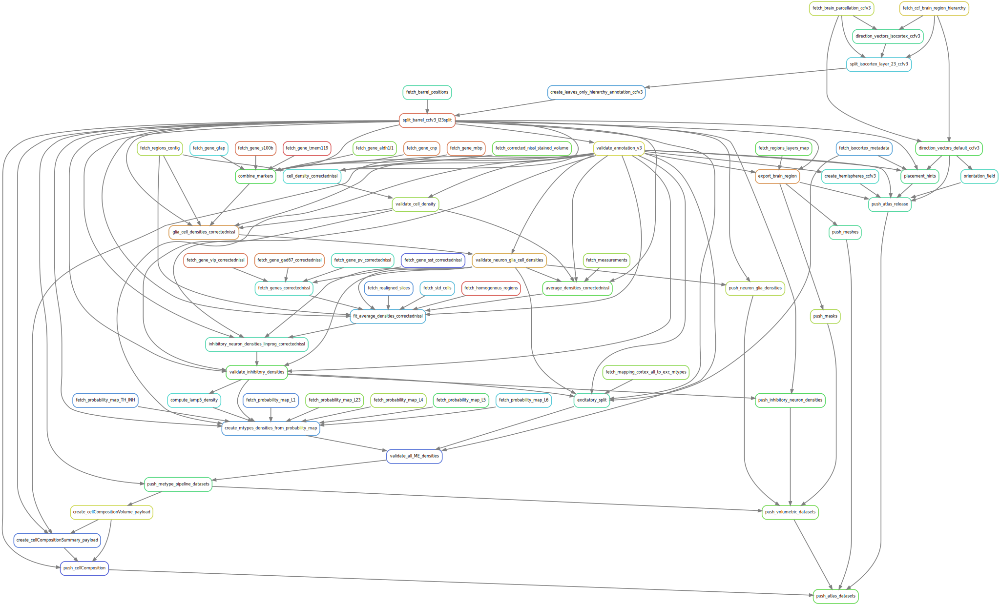

# Blue Brain Atlas Pipeline

## Introduction

The Blue Brain Atlas Pipeline (BBAP) is a set of processing modules that generate new data such as:

- Direction vectors, orientations and placement hints for selected brain regions,
- Cell density volumes for several cell types,
- CellComposition summary of the brain regions.

Data are always fetched from [Nexus](https://bbp.epfl.ch/nexus/web/). If the data are not yet in Nexus, then a phase of 
data integration has to happen beforehand. Having a unique source of data enforces reproducibility and favors 
traceability and provenance. The pipeline input data originally comes from different experiments performed on the 
"Allen Institute for Brain Science (AIBS)" P56 adult mouse brain.

At the present time, the goal of this pipeline is to generate some key reference datasets
for The Blue Brain Project (BBP) to be used by BBP researchers and engineers.


## Installation

The Blue Brain Atlas Pipeline (BBAP) can be installed in three different ways:
- via a [Singularity image](#singularity-image-on-bb5) (recommended),
- via a [Docker image](#docker-image),
- via this [Git repository](#git-repository).

For computation time reason and ease of installation, it is recommended to run the pipeline 
on the BB5 cluster via the Singularity image described [hereafter](#singularity-image-on-bb5).
You can log in to the cluster with  
`ssh -l <your-Gaspar-username> bbpv1.epfl.ch`  
and your Gaspar password.

Once the installation step is completed, go to [Run the pipeline](#run-the-pipeline) for the instructions to run the pipeline.

### Singularity image on BB5
A Singularity image (created from the [Docker image](#docker-image)) is available on BB5 in:  
`/gpfs/bbp.cscs.ch/data/project/proj83/singularity-images/`

The folder contains
- `blue_brain_atlas_pipeline_dev.sif`: development image regularly updated,
- `blue_brain_atlas_pipeline_<tag>.sif`: production image corresponding to a repository [tag](https://bbpgitlab.epfl.ch/dke/apps/blue_brain_atlas_pipeline/-/tags)
  (such as `v0.5.2`).

One can run the corresponding container with  
1. `module load unstable singularityce`
2. `singularity shell /gpfs/bbp.cscs.ch/data/project/proj83/singularity-images/blue_brain_atlas_pipeline_dev.sif`

and access the pipeline files at  
3. `Singularity> cd /pipeline/blue_brain_atlas_pipeline/`

### Docker image
A [Docker](https://docs.docker.com/reference) image containing all the pipeline dependencies is available in the Git [registry](https://bbpgitlab.epfl.ch/dke/apps/blue_brain_atlas_pipeline/container_registry/159):  
`bbpgitlab.epfl.ch:5050/dke/apps/blue_brain_atlas_pipeline:<tag>`  
where `<tag>` = `dev` or a repository tag. 

It can be pulled and run with  
1. `docker login bbpgitlab.epfl.ch:5050 -u <your-Gaspar-username> -p <your-Gaspar-password>`
2. `docker pull bbpgitlab.epfl.ch:5050/dke/apps/blue_brain_atlas_pipeline:<tag>`
3. `docker run -it bbpgitlab.epfl.ch:5050/dke/apps/blue_brain_atlas_pipeline:<tag> bash`

or converted into an **Apptainer** image with  
`apptainer pull --docker-login docker://bbpgitlab.epfl.ch:5050/dke/apps/blue_brain_atlas_pipeline:<tag>`

Alternatively, one can manually install the pipeline (and its dependencies) manually as described [next](#git-repository).

### Git repository
The BBAP can be installed directly from the `setup.py` file available in this repository:

1. `git clone https://bbpgitlab.epfl.ch/dke/apps/blue_brain_atlas_pipeline.git`
2. `pip install blue_brain_atlas_pipeline/`

Each package run as part of the pipeline is considered a pipeline dependency:

- [token-fetch](https://bbpgitlab.epfl.ch/dke/apps/blue_brain_nexus_token_fetch)
- [nexusforge](https://github.com/BlueBrain/nexus-forge)
- [bba-datafetch](https://bbpteam.epfl.ch/project/spaces/display/BBKG/bba-data-fetch)
- [atlas-direction-vectors](https://bbpteam.epfl.ch/project/spaces/display/BBKG/direction-vectors)
- [atlas-splitter](https://bbpteam.epfl.ch/project/spaces/display/BBKG/region-splitter)
- [atlas-placement-hints](https://bbpteam.epfl.ch/project/spaces/display/BBKG/placement-hints)
- [parcellationexport](https://bbpteam.epfl.ch/project/spaces/display/BBKG/parcellationexport)
- [bba-data-integrity-check](https://bbpteam.epfl.ch/project/spaces/display/BBKG/bba-data-check)
- [bba-data-push](https://bbpteam.epfl.ch/project/spaces/display/BBKG/bba-data-push)

On BB5, most packages are available also as modules:
```
module load unstable \
snakemake \
py-token-fetch \
py-nexusforge \
py-bba-datafetch \
py-atlas-building-tools \
py-bba-webexporter \
py-data-integrity-check \
py-bba-data-push
```
Or they can be installed following the ‘Installation’ section in their Confluence documentation page.


## Run the pipeline

Once the pipeline environment is installed, the command to run the pipeline is:
```
bbp-atlas  --target-rule <target_rule>  --snakemake-options '<options>'
```
where `<target_rule>` represents the target action to execute.

The "highest-level" rules are:
- `push_atlas_release`: create an AtlasRelease Resource along with all its properties and push it in Nexus;
- `push_cellcomposition`: generate and push into Nexus the SBO CellComposition along with its properties (CellCompositionVolume and CellCompositionSummary);
- `push_atlas_datasets`: global rule to generate and push into Nexus every Atlas dataset (triggers both `push_atlas_release` and `push_cellcomposition`).

Those rules trigger all the intermediate rules (as described [below](#blue-brain-atlas-pipeline-1)) needed to produce the final datasets, such as:
- `placement_hints`: create placement hints for isocortex region;
- `create_mtypes_densities_from_probability_map`: generate a set of METype densities files based on the input probability map(s).

_Note: the pipeline framework (Snakemake) resolves the data dependencies and automatically schedules the tasks to be 
run when data are missing. Hence, there is no need to run all the tasks manually, only the target one._

The `push_*` rules requires write access to the Nexus project specified in the pipeline [configuration](#Configuration).
In order to generate the datasets and skip the Nexus registration, the default value of the configuration variable `NEXUS_REGISTRATION` is `False`.  
Users will be enabled to register data in Nexus at a later stage.

_Note: Snakemake may ask to specify the maximum number of CPU cores to use during the run.  
If this occurs, add the argument  `--cores <number_of_cores>` into `--snakemake-options`._


### Customize a pipeline rule

It is possible to customize a pipeline rule that generates a (set of) volumetric file (`.nrrd`) in order to change the values of a
specific region of the volume.
The customization happens through a configuration file provided by the user following the structure of [this sample configuration](https://bbpgitlab.epfl.ch/dke/apps/blue_brain_atlas_pipeline/-/blob/develop/customize_pipeline/user_config.json):
- `target_rule`: name of the final rule to execute;
- `rule`: name of the rule to customize from the default pipeline;
- `brainRegion`: ID of the brain region to customize;
- `output_dir`: path of the folder where the volumetric file(s) is generated by the CLI;
- `CLI`:
  - `command`: CLI to execute in order to produce the volumetric file with the desired values for the brain region of interest;
  - `args`: CLI arguments that can reference variables between curly brackets (see below);
- `container`: URL of the Docker image to use in order to spawn a container where the CLI will be executed. This parameter
is optional: if not provided, the CLI will be executed in the same environment of the default pipeline (in such a case,
the user must ensure that the provided CLI is defined therein).

The CLI `args` can reference one or more variables which points to files generated by pipeline rules executed before the
rule to customize. The list of variables is available in [this file](https://bbpgitlab.epfl.ch/dke/apps/blue_brain_atlas_pipeline/-/blob/develop/customize_pipeline/available_vars.yaml).
The user must ensure that the files generated by the provided CLI have the same names of the files generated by the rule
to customize. For example, the rule `direction_vectors_placeholder_ccfv3` in the sample configuration generates one output file `direction_vectors_ccfv3.nrrd`.
The `placement_hints` rule generates seven volumetric files: `[PH]y.nrrd` and `[PH]layer_n.nrrd` where n = 1, ..., 6.

Once the configuration file is ready, the customized pipeline can be run with the following command:
```
bbp-atlas  --target-rule <target_rule>  --user-config-file <user_config_path>  --snakemake-options '<options>'
```
where `<target_rule>` is the targeted rule of the pipeline (required if no user configuration is provided),
and `<user_config_path>` is the path of the user configuration file.
Snakemake `options` can be listed in a single string via the optional `--snakemake-options` argument.  
_Note_: the Snakemake option `--use-singularity` must be provided for the configuration parameter `container` to be considered.


#### Integration
In case a user wants to request the integration of the customized version of a dataset:
1. Open a Merge Request (MR) in this repository including the `user-config-file` and any additional input metadata required.
2. The MR is then reviewed and, if approved, a new Atlas pipeline dev image is produced accordingly.
3. The new pipeline is run and the new datasets are registered in Nexus staging for wider tests.
4. When the new version of the datasets is validated, a new tag of the Atlas pipeline is cut and the corresponding image is used to 
register the datasets in Nexus prod.


### Useful Snakemake command line arguments

Snakemake being a command-line tool, it comes with a multitude of optional arguments to
execute, debug, and visualize workflows. Here is a selection of the most used:

- `snakemake --dry-run`, `-n` → To conduct a dry run (execute nothing but print a
summary of jobs that would be done).

- `snakemake --forcerun <some_rule>` → Force a given rule to be re-executed (overwrite
the already created output).

- `snakemake --list`, `-l` → Print a list of all the available rules from the snakefile.

- `snakemake <some_rule> --dag | dot -Tpdf > <name_of_your_DAG>.svg` → Save in a svg file
the directed acyclic graph (DAG) of jobs representing the selected workflow in the dot language.
Note that the package [graphviz](https://graphviz.org/) needs to be installed. On BB5 it is available as a
module that can be loaded with `module load unstable graphviz`.

Every Snakemake command line argument is listed and described in the Snakemake official documentation page.


## Blue Brain Atlas Pipeline

Its workflow consists of 4 steps :
- Fetch the required datasets from Nexus. These input data consist of the [original AIBS ccfv3 brain parcellation](https://bbp.epfl.ch/nexus/web/bbp/atlas/resources/https%3A%2F%2Fbbp.epfl.ch%2Fneurosciencegraph%2Fdata%2F025eef5f-2a9a-4119-b53f-338452c72f2a) 
and the [AIBS Mouse CCF Atlas regions hierarchy file](https://bbp.epfl.ch/nexus/web/neurosciencegraph/datamodels/resources/http%3A%2F%2Fbbp.epfl.ch%2Fneurosciencegraph%2Fontologies%2Fmba) 
as described in the documentation page [Allen Mouse CCF Compatible Data](https://bbpteam.epfl.ch/project/spaces/display/BBKG/Allen+Mouse+CCF+Compatible+Data).

- The fetched datasets are then fed to the [Snakemake](https://snakemake.readthedocs.io/en/stable/) rules, and under the hood consumed by atlas modules to generate products.

- Each product can (optionally) be pushed into Nexus with a set of metadata automatically filled up and be visualised in 
the [Blue Brain Atlas](https://bbpteam.epfl.ch/documentation/#:~:text=Visualize-,Blue%20Brain%20Atlas,-Morphology%20visualization).

This workflow is illustrated on the following diagram containing the directed acyclic graph (DAG)
of the Snakemake rules of the BBAP:



A more detailed DAG listing the input and ouput files for each step is available [here](doc/source/figures/dag_push_atlas_fg.svg). 

***
**Rules and modules**  
In this document, a “module” is a CLI encapsulated inside one of the components of the pipeline.
Such component is called a “rule”. This terminology comes from SnakeMake, where a “rule” 
can leverage one or more modules and where a module can be used by one of more rules,
usually using a different set of arguments.  
You can find more information on rules in the [SnakeMake documentation](https://snakemake.readthedocs.io/en/stable/).
***


**Additional information**  
More information about The Blue Brain Atlas Pipeline (BBAP) are available in its [confluence documentation](https://bbpteam.epfl.ch/project/spaces/display/BBKG/Atlas+Pipeline).  
This space contains several documentation pages describing:  
The Allen Mouse CCF Compatible Data : [https://bbpteam.epfl.ch/project/spaces/display/BBKG/Allen+Mouse+CCF+Compatible+Data](https://bbpteam.epfl.ch/project/spaces/display/BBKG/Allen+Mouse+CCF+Compatible+Data)   
The Atlas Modules : [https://bbpteam.epfl.ch/project/spaces/display/BBKG/Atlas+Modules](https://bbpteam.epfl.ch/project/spaces/display/BBKG/Atlas+Modules)


## Configuration

The configuration of the pipeline is provided in the `config.yaml` file. The most important
variables that a user can customize are:

- `WORKING_DIR`: the output directory of the pipeline files,
- `NEXUS_IDS_FILE`: the json file containing the Ids of the Nexus Resources to fetch,
- `FORGE_CONFIG`: the configuration file (yaml) to instantiate nexus-forge,
- `NEW_ATLAS`: boolean flag to trigger the creation of a brand-new atlas release,
- `RESOLUTION`: resolution (in μm) of the input volumetric files to be consumed by the pipeline (default to 25),
- `NEXUS_REGISTRATION`: boolean flag to trigger data registration in Nexus
- `RESOURCE_TAG`: string to use as tag of the data registered in Nexus
- `IS_PROD_ENV`: boolean flag to indicate whether the target Nexus environment is production or not (staging),
- `NEXUS_DESTINATION_ORG`/`NEXUS_DESTINATION_PROJ`: Nexus organization/project where register the pipeline products,
- `DISPLAY_HELP`: boolean flag to display every rule of the snakefile with its descriptions.

It is possible to override the config variables at runtime using the snakemake argument `--config`:  
`--config <VAR_NAME>=<VALUE>`


## Authors and Contributors :

* Leonardo Cristella: <leonardo.cristella@epfl.ch>
* Nabil Alibou: <nabil.alibou@epfl.ch>
* Jonathan Lurie: <jonathan.lurie@epfl.ch>

The BBAP is currently maintained by the BlueBrain DKE team: <bbp-ou-dke@groupes.epfl.ch>.
If you face any issue using the BBAP, please send an e-mail to one of the contributors.
